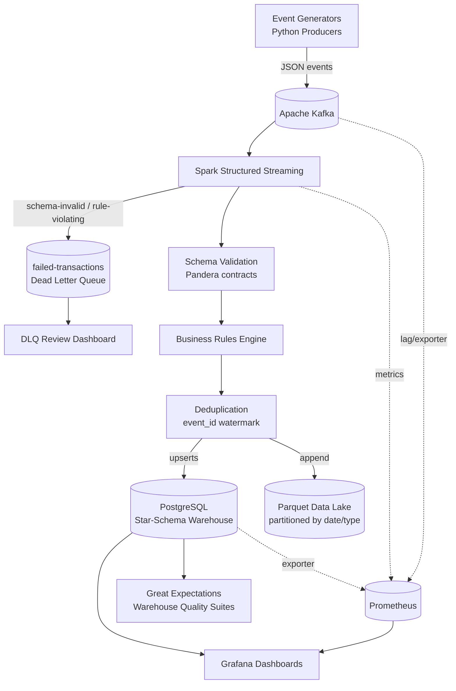

# TeleStream Architecture

This document describes the system design of TeleStream: an enterprise-inspired streaming
data platform simulating a telecom operator's real-time event flow.

## 1. System Overview



The platform simulates the analytics backbone of a telecom operator (think Vodacom-scale
event variety at laptop-scale volume). Every second the "network" emits SIM activations,
airtime recharges, bundle purchases, voice calls, SMS, data sessions, tower connections,
roaming events, and failed transactions. The platform's job is to ingest, validate,
enrich, store, and visualize these in near real time.

## 2. Component Responsibilities

### 2.1 Event Generators (`producer/`)

Python producers that synthesize realistic telecom events and publish them to Kafka.

- **One generator per event domain**, sharing a base class that handles pacing, ID
  management, and Kafka publishing.
- **Stateful realism:** generators share a registry of active subscribers and towers so
  that events reference entities that exist (a call comes from a real subscriber, on a
  real tower). A configurable fraction of events is deliberately malformed or
  rule-violating to exercise the DLQ path.
- **South African flavour:** MSISDNs in `27XXXXXXXXX` format, provinces as geographic
  dimension, ZAR amounts, real metro tower names (Cape Town CBD, Bellville,
  Century City, Sandton, ...). All data is synthetic.
- **Throughput** is configurable via environment variables (`EVENTS_PER_SECOND`,
  `ERROR_RATE`), defaulting to a rate that a laptop handles comfortably.

### 2.2 Apache Kafka

Message backbone. One topic per event domain plus the dead letter queue:

| Topic | Producer | Notes |
|---|---|---|
| `subscriber-created` | subscriber generator | Low volume, drives dim_subscriber |
| `airtime-purchases` | recharge generator | Revenue-bearing |
| `bundle-purchases` | recharge generator | Revenue-bearing |
| `voice-calls` | call generator | Highest volume with data-usage |
| `sms` | call generator | |
| `data-usage` | usage generator | |
| `tower-events` | network generator | Drives network health KPIs |
| `failed-transactions` | Spark (DLQ sink) + generators (simulated payment failures) | Dead letter + business failures |

- Keys are the subscriber ID (or tower ID for tower events) so per-entity ordering holds
  within a partition.
- Runs in KRaft mode (no Zookeeper) if the chosen image supports it; otherwise
  Zookeeper is included in Compose.
- Full contracts: [event-schemas.md](event-schemas.md).

### 2.3 Spark Structured Streaming (`spark/`)

A single PySpark application reading all topics, structured as per-topic pipelines that
share common stages:

1. **Deserialize & schema-validate** — parse JSON against the Pandera/StructType contract.
   Corrupt or non-conforming records are routed to the DLQ with `rejection_reason`.
2. **Business rules** — pure-function rules per event type (see §4). Violations go to
   the DLQ, tagged with the failed rule.
3. **Deduplicate** — `dropDuplicates` on `event_id` within a watermark window.
4. **Enrich & aggregate** — join to dimension data (subscriber, tower, bundle), compute
   windowed metrics (per-minute call counts, MB per tower, revenue per province).
5. **Sink** —
   - **PostgreSQL:** idempotent upserts (`ON CONFLICT` on `event_id` / natural key) into
     fact tables and aggregate tables via `foreachBatch`.
   - **Parquet:** append raw validated events to the data lake, partitioned by
     `event_type/date`.
   - Checkpointing on every sink so the job restarts without data loss or duplication.

### 2.4 Data Quality (`quality/`)

Two layers, deliberately different in character:

- **Pandera (in-stream, per-record):** schema contracts enforced inside the Spark job and
  reused in producer unit tests, so producer and consumer agree on one definition.
- **Great Expectations (at-rest, batch):** suites run against the warehouse (no null
  subscriber IDs, no duplicate transaction IDs, recharge amounts positive, referenced
  bundles exist, timestamps within valid range). Runs in CI integration tests and on a
  schedule; results published as data docs.

### 2.5 PostgreSQL Warehouse (`warehouse/`)

Star schema serving both operational queries and Grafana. Dimensions
(`dim_subscriber`, `dim_tower`, `dim_bundle`, `dim_date`) and facts (`fact_calls`,
`fact_data_usage`, `fact_recharges`, `fact_sms`, `fact_bundle_sales`), plus a
`dlq_records` table for the review dashboard and pre-aggregated minute-level rollup
tables for dashboard speed. Full model: [data-model.md](data-model.md).

### 2.6 Parquet Data Lake

Append-only archive of validated events: `lake/{event_type}/date=YYYY-MM-DD/*.parquet`.
This is the replay/reprocessing source and the seam where a lakehouse upgrade
(Iceberg/Delta) slots in later.

### 2.7 Grafana (`dashboards/`)

Four provisioned dashboards (JSON in git, auto-loaded on startup):

| Dashboard | Audience | Panels |
|---|---|---|
| **Executive** | Leadership | Active subscribers, total revenue (recharge + bundle), calls, bundle sales, platform health |
| **Network** | NOC | Tower load, connections by technology, dropped calls, signal strength heat |
| **Sales** | Commercial | Recharge revenue, bundle revenue, top products, revenue by province |
| **Customer** | CVM | New subscribers, churn proxy, top users, ARPU |

Plus a fifth **Pipeline Ops** dashboard fed by Prometheus: Kafka consumer lag, batch
duration, records/sec, DLQ rate, container CPU/memory.

### 2.8 Prometheus (`monitoring/`)

Scrapes:

- **Pipeline metrics** exposed by the Spark job / a small metrics sidecar: messages
  processed, failed records, end-to-end latency, batch duration.
- **Kafka exporter:** consumer lag per topic — the single most important streaming
  health signal.
- **Postgres exporter** and container metrics (cAdvisor or equivalent).

Alert rules (as code) for: consumer lag growth, DLQ rate above threshold, no events
processed for N minutes.

## 3. Data Flow — Life of an Event

1. Recharge generator emits an `airtime-purchase` for subscriber `10238`, keyed by
   subscriber ID, to the `airtime-purchases` topic.
2. Spark micro-batch picks it up, validates against the contract. A negative amount or
   missing field would divert it to `failed-transactions` here.
3. Business rules run: subscriber must exist, amount within bounds, timestamp not in the
   future. Pass → continue; fail → DLQ with the rule name.
4. Deduplication drops any replayed `event_id` within the watermark.
5. `foreachBatch` upserts the row into `fact_recharges` and increments the minute-level
   revenue rollup; the raw event is appended to `lake/airtime-purchases/date=.../`.
6. Within seconds, the Sales dashboard's "Recharge Revenue" panel reflects it; Prometheus
   records the batch's processing metrics.

## 4. Business Rules Engine

Rules are **pure Python functions** — `(event) -> RuleResult` — registered per event type,
unit-testable without Spark, applied inside the stream:

| Rule | Applies to | Rationale |
|---|---|---|
| Amount must be positive | recharges, bundles | Negative revenue is corruption, not a refund flow |
| Subscriber must exist | all subscriber-keyed events | Referential integrity at ingestion |
| Call duration ≤ 6 hours | voice-calls | Network hard limit |
| Data session ≤ realistic cap | data-usage | Physically implausible sessions are meter errors |
| Tower must exist | calls, data, tower-events | Referential integrity |
| Timestamp not in the future (> small skew allowance) | all | Clock-skew guard |
| MSISDN matches `27\d{9}` | subscriber-created | Format contract |

Every rejection carries: original payload, rule violated, source topic, and rejection
timestamp — enough to triage from the DLQ review dashboard alone.

## 5. Error Handling & Dead Letter Queue

```
bad record → failed-transactions topic → dlq_records table → DLQ Review panel (Grafana)
```

- Nothing is silently dropped. Parse failures, schema violations, and rule violations all
  land in the DLQ with machine-readable reasons.
- The DLQ is itself consumed by Spark into `dlq_records` so failures are queryable and
  chartable (failure rate by reason/topic over time).
- Replay story: because raw events also land in Parquet, any fixed bug allows
  reprocessing from the lake.

## 6. Deployment Topology (Docker Compose)

| Service | Image basis | Purpose |
|---|---|---|
| `kafka` | bitnami/kafka or confluent | Broker (KRaft if possible) |
| `spark` | custom (`docker/spark/`) | Streaming job, submitted on start |
| `postgres` | postgres:16 | Warehouse; `warehouse/schema.sql` applied on init |
| `grafana` | grafana/grafana | Dashboards + datasources provisioned from `dashboards/` |
| `prometheus` | prom/prometheus | Scrape configs from `monitoring/` |
| `kafka-exporter` | danielqsj/kafka-exporter | Consumer lag metrics |
| `postgres-exporter` | prometheuscommunity/postgres-exporter | DB metrics |
| `producer` | custom (`docker/producer/`) | Event generators |

Startup ordering is enforced with health checks (`depends_on: condition: service_healthy`),
not sleeps. A fresh clone must reach a fully working demo with `docker compose up -d`.

## 7. CI/CD (GitHub Actions)

```
push/PR → ruff lint + format check → mypy → pytest (unit)
        → docker build (producer, spark)
        → docker compose up (CI profile) → pytest (integration) → teardown
```

Integration tests assert the real path end-to-end: known events in → expected warehouse
rows and DLQ records out. Docs build (`mkdocs build --strict`) also runs in CI so broken
doc links fail the pipeline.

## 8. Scale & Honesty Notes

This runs on one machine at hundreds–thousands of events/sec. The design decisions —
partitioned topics, keyed ordering, idempotent sinks, checkpointing, DLQ, star schema,
lag-based alerting — are the same ones that matter at millions of events/sec; the
difference is horizontal sizing (broker count, partition count, executor count), not
architecture. The README should state this framing explicitly rather than overclaiming.

## 9. Extension Seams (Stretch Goals)

Designed-in seams for future work, in rough order of payoff:

1. **Schema Registry + Avro** — replaces JSON contracts; producers/consumers already share
   one schema definition, so the migration is localized.
2. **Iceberg or Delta over the Parquet lake** — same sink stage, upgraded table format.
3. **dbt** on the warehouse — rollup tables become dbt models.
4. **Debezium CDC** from Postgres — demonstrates the reverse data-flow pattern.
5. **FastAPI KPI service**, **ML anomaly detection** on tower/recharge patterns,
   **Terraform** for cloud deploy, **OpenTelemetry** tracing.
