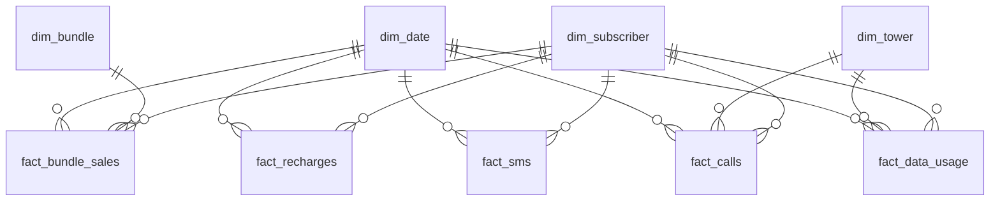

# Warehouse Data Model

Star schema for the TeleStream PostgreSQL warehouse. Implemented in
`warehouse/schema.sql`; changes go through numbered migrations.

## Design Principles

- **Star schema:** facts hold measures and foreign keys; dimensions hold descriptive
  attributes. Grafana queries join at most one fact to its dimensions.
- **Surrogate keys** (`*_key`, generated) in dimensions; facts reference surrogate keys.
  Natural keys (`subscriber_id`, `tower_id`, `bundle_code`) kept with unique constraints.
- **Idempotent loads:** every fact table has a unique constraint on `event_id`; Spark
  upserts with `ON CONFLICT (event_id) DO NOTHING`, so replays are safe.
- **Rollups for dashboards:** minute-level aggregate tables keep Grafana panels fast
  without scanning raw facts.

## Entity Relationship Overview

## Dimensions

### dim_subscriber
Maintained from the `subscriber-created` stream.

| Column | Type | Notes |
|---|---|---|
| subscriber_key | bigint PK | Surrogate |
| subscriber_id | bigint UNIQUE | Natural key from events |
| msisdn | varchar(11) UNIQUE | `27XXXXXXXXX` |
| plan | varchar(16) | Prepaid / Contract / TopUp |
| province | varchar(32) | One of 9 SA provinces |
| created_at | timestamptz | From the creation event |
| is_active | boolean | Churn flag (future use) |

### dim_tower
Seeded at init from a fixture file (towers are static reference data).

| Column | Type | Notes |
|---|---|---|
| tower_key | bigint PK | Surrogate |
| tower_id | varchar(16) UNIQUE | e.g. `CPT-CBD-001` |
| tower_name | varchar(64) | e.g. Cape Town CBD |
| province | varchar(32) | |
| technologies | varchar(16)[] | Supported: 3G/LTE/5G |

### dim_bundle
Seeded product catalog.

| Column | Type | Notes |
|---|---|---|
| bundle_key | bigint PK | Surrogate |
| bundle_code | varchar(32) UNIQUE | e.g. `DATA_5GB` |
| bundle_name | varchar(64) | |
| bundle_type | varchar(16) | DATA / VOICE / SMS / COMBO |
| size_mb / minutes / sms_count | int nullable | Whichever applies |
| price | numeric(10,2) | ZAR catalog price |

### dim_date
Standard pre-generated calendar dimension (date_key `YYYYMMDD`, date, day-of-week,
month, quarter, year, is_weekend). Facts also keep the raw `event_timestamp` for
minute-level Grafana time series — dim_date serves daily+ analytical slicing.

## Facts

All facts share: `event_id uuid UNIQUE` (idempotency), `event_timestamp timestamptz`
(indexed — Grafana's time axis), `date_key int REFERENCES dim_date`.

### fact_recharges
| Column | Type |
|---|---|
| recharge_key | bigserial PK |
| subscriber_key | bigint → dim_subscriber |
| amount | numeric(10,2) |
| payment_method | varchar(16) |

### fact_bundle_sales
| Column | Type |
|---|---|
| sale_key | bigserial PK |
| subscriber_key | bigint → dim_subscriber |
| bundle_key | bigint → dim_bundle |
| price | numeric(10,2) |

### fact_calls
| Column | Type |
|---|---|
| call_key | bigserial PK |
| caller_key | bigint → dim_subscriber |
| receiver_msisdn | varchar(11) |
| tower_key | bigint → dim_tower |
| duration_seconds | int |
| dropped | boolean |

### fact_sms
| Column | Type |
|---|---|
| sms_key | bigserial PK |
| sender_key | bigint → dim_subscriber |
| receiver_msisdn | varchar(11) |
| length | int |

### fact_data_usage
| Column | Type |
|---|---|
| usage_key | bigserial PK |
| subscriber_key | bigint → dim_subscriber |
| tower_key | bigint → dim_tower |
| mb_used | numeric(12,2) |
| session_seconds | int |
| technology | varchar(8) |

## Operational Tables (outside the star)

### dlq_records
Queryable dead letter queue for the review dashboard.

| Column | Type |
|---|---|
| dlq_key | bigserial PK |
| event_id | uuid |
| source_topic | varchar(64) |
| rejection_reason | varchar(128) |
| original_payload | jsonb |
| rejected_at | timestamptz |

### tower_status_current
Latest-state table (upsert on `tower_id`) powering the Network dashboard's live tower
health panels: signal_strength, connected_devices, status, updated_at.

## Rollup Tables

Maintained incrementally by Spark's `foreachBatch`; primary key `(minute, ...group)`:

| Table | Grain | Measures |
|---|---|---|
| agg_revenue_minute | minute × province × revenue_type | total_amount, txn_count |
| agg_calls_minute | minute × tower_key | call_count, dropped_count, total_duration |
| agg_data_minute | minute × tower_key × technology | total_mb, session_count |
| agg_dlq_minute | minute × source_topic × reason | record_count |

## KPI → Model Mapping

| KPI | Source |
|---|---|
| Subscribers online / new subscribers | dim_subscriber (created_at) |
| Transactions per second | agg_revenue_minute, agg_calls_minute |
| Calls per minute / dropped calls | agg_calls_minute |
| Data usage per minute | agg_data_minute |
| Average recharge / recharge revenue | fact_recharges, agg_revenue_minute |
| Bundle sales / top products | fact_bundle_sales + dim_bundle |
| Revenue by province | agg_revenue_minute |
| ARPU | revenue facts ÷ active dim_subscriber count |
| Network errors / failed payments | agg_dlq_minute, dlq_records |
| Tower load / signal strength | tower_status_current, agg_data_minute |
